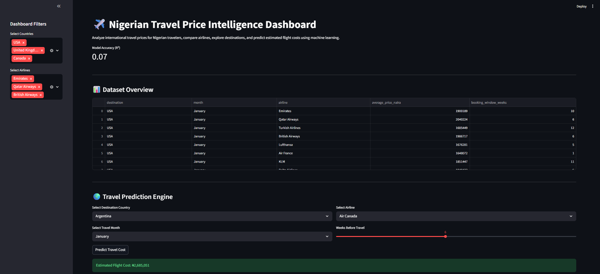
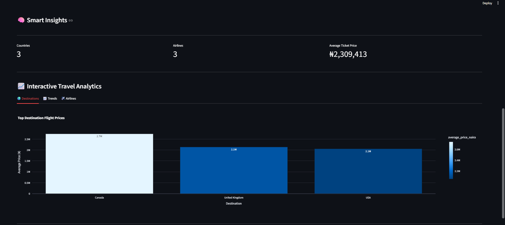

#  Travel Price Intelligence System

An interactive machine learning dashboard that analyzes and predicts international flight prices for Nigerian travelers.

The system provides travel price forecasting, airline comparisons, destination analytics, booking insights, and seasonal trend analysis through an advanced Streamlit dashboard.

---

#  Dashboard Preview

##  Main Dashboard



##  Analytics Overview



##  Prediction Engine


##  Dashboard Filters


---

#  Project Overview

Travel prices for Nigerians often fluctuate due to:

- Seasonal demand
- Airline pricing differences
- Booking timing
- International destination popularity
- Peak travel periods

This project was designed to simulate a real-world travel intelligence platform capable of helping travelers make more informed travel decisions using data analytics and machine learning.

---

#  Features

##  Interactive Dashboard
- Modern Streamlit dashboard
- Responsive dark-mode analytics interface
- KPI summary cards
- Interactive tabs and filters

##  Machine Learning Prediction
Predict estimated flight costs based on:
- Destination country
- Travel month
- Airline
- Booking window

## Airline Analytics
- Compare average airline pricing
- Analyze premium vs budget airlines
- Explore airline travel trends

##  Destination Analytics
- Top flight destinations for Nigerian travelers
- Most expensive travel routes
- Country-level pricing analysis

##  Monthly Travel Trends
- Peak travel periods
- Seasonal pricing changes
- Holiday demand analysis

## Popular Destinations Explorer
Explore popular cities within major travel destinations including:
- USA
- Canada
- United Kingdom
- France
- South Africa

---

#  Machine Learning Model

The project uses:

- Linear Regression
- Label Encoding
- Train/Test Split Validation
- R² Accuracy Evaluation

The model predicts estimated flight pricing using historical travel data.

---

#  Tech Stack

- Python
- Streamlit
- Pandas
- Scikit-learn
- Plotly
- NumPy

---

#  Project Structure

```text
travel-price-intelligence/
│
├── screenshots/
├── dataset.csv
├── main.py
├── app.py
├── requirements.txt
├── README.md
```

---

#  Run Project Locally

## 1. Install Dependencies

```bash
pip install -r requirements.txt
```

## 2. Start Dashboard

```bash
streamlit run app.py
```

---

#  Dashboard Features

The dashboard includes:

- Country filters
- Airline filters
- Interactive analytics tabs
- Price comparison charts
- Monthly trend visualization
- Airline pricing insights
- Real-time prediction engine

---

#  Sample Analytics

## Destination Analytics
Compare average flight prices across international destinations.

## Airline Comparison
Analyze airline pricing differences for Nigerian travelers.

## Monthly Trend Analysis
Track travel price fluctuations from January to December.

---

#  Project Goal

The objective of this project is to demonstrate:

- Applied machine learning
- Data analytics
- Dashboard development
- Data visualization
- User-focused UI/UX design
- Real-world problem solving

---

#  Author

Matthew Obayemi

Computer Science Student  
University of the People

---

#  Future Improvements

Planned upgrades include:

- Real-time flight APIs
- Live currency conversion
- Hotel recommendation engine
- Flight demand forecasting
- Travel budget planner
- AI-powered travel recommendations

---

#  License

This project demonstrates the application of machine learning, interactive analytics, and data visualization in solving real-world travel pricing challenges for Nigerian travelers.
